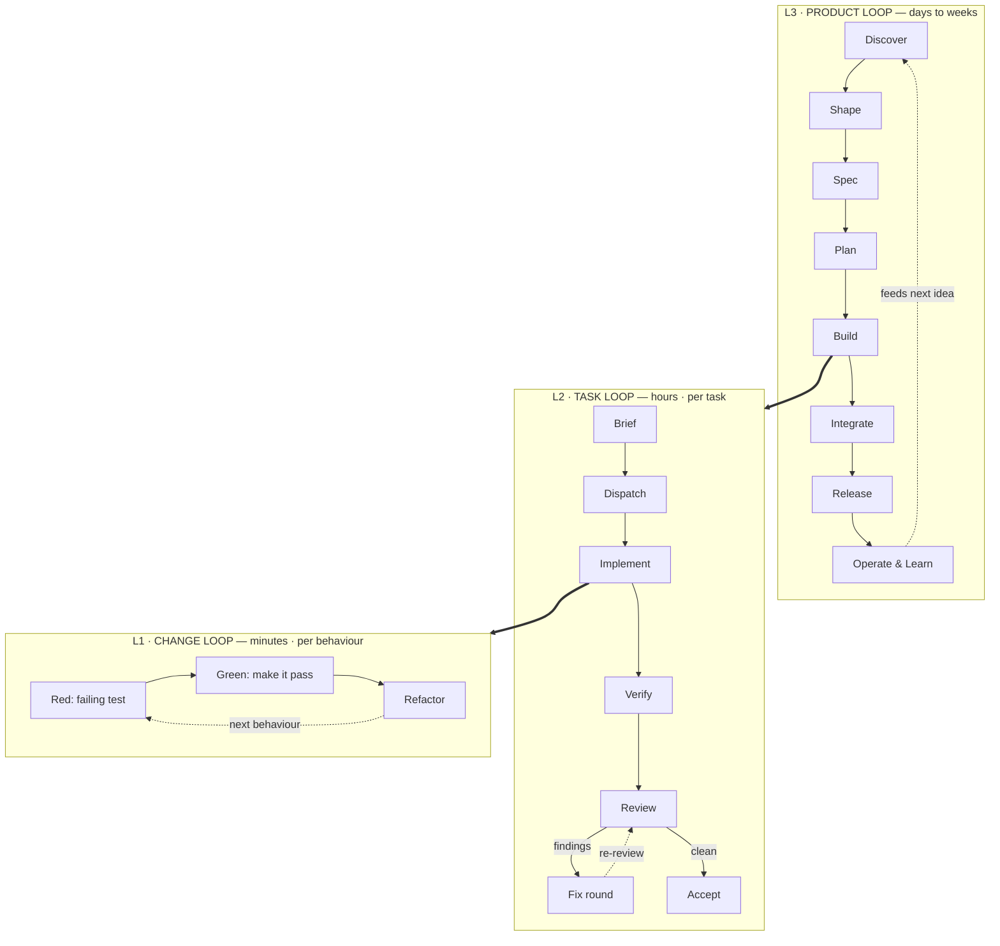
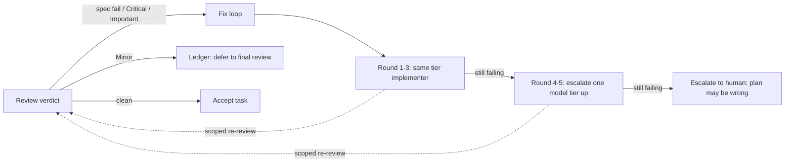

# The Full Development Loop

An agent-native ("loop engineering") development methodology, from raw idea to
shipped software to the learnings that seed the next idea — with every stage
mapped to the skills in this hub, and the stages that have **no skill yet**
called out explicitly.

Read this in three parts:

- **Part A — The Methodology.** The loop itself, independent of any skill.
- **Part B — The Skill Map.** Which skill drives each stage.
- **Part C — The Gaps.** Stages with no skill, ranked by how badly they hurt.

> **Executable form:** `skills/vitep/build-loop/` drives this loop end to end
> for greenfield projects. This document is its reference — Part B is the
> authority for the stage → skill mapping, and `build-loop`'s
> `reference/skill-map.md` is derived from it.

---

## Part A — The Methodology

### A.1 Three nested loops

Agent-driven development is not one pipeline. It is three loops running at
different clock speeds, each nested inside the next.



**L1 — the change loop (minutes).** One agent, one behaviour. Red → green →
refactor. The unit of *correctness*.

**L2 — the task loop (hours).** One orchestrator, one task, one or more
subagents. Brief → dispatch → implement → verify → review → fix → accept. The
unit of *trust* — nothing leaves L2 unreviewed.

**L3 — the product loop (days–weeks).** The whole team-of-agents. Discover →
ship → learn → discover again. The unit of *value*.

The critical property: **each loop is a gate for the one above it.** L1 will
not exit without a passing test. L2 will not exit without a clean review. L3
will not exit without evidence in production. Failures fall *down* a loop, not
forward — a bad review does not become a release note, it becomes another L2
fix round.

### A.2 The full stage list

| # | Phase | Stages |
|---|---|---|
| 0 | **Bootstrap** | skill discipline · environment readiness · session continuity |
| 1 | **Discover** (divergent) | idea capture · user intent · prior art · success metrics · feasibility spike |
| 2 | **Shape** (convergent) | option exploration · adversarial pressure-test · scope cut · risk register |
| 3 | **Specify** | functional spec · non-functional requirements · architecture + ADRs · data/API contracts · UX design · dependency selection |
| 4 | **Plan** | large-scope mapping · implementation plan · ticket graph · estimation/sequencing · plan self-review |
| 5 | **Orchestrate** | isolated workspace · clean baseline · execution mode · model/cost tiering · task briefs |
| 6 | **Build** (L2×N) | dispatch · TDD · status handling · self-verification · debugging · commit |
| 7 | **Review & Fix** | review package · multi-axis review · domain review · receiving feedback · fix rounds w/ escalation · adjudication |
| 8 | **Integrate** | whole-branch review · finish branch · conflict resolution · CI gate |
| 9 | **Release** | versioning/changelog · CI/CD deploy · migrations · rollback & flags · documentation |
| 10 | **Operate & Learn** | observability · incident/postmortem · analytics vs metrics · tech-debt · retro · **encode learnings as skills** |

Stage 10 closes the loop twice over: learnings feed the next Discover, *and*
learnings that are procedural get written back as new skills — which upgrades
Phase 0 for every future run. That second arrow is what makes the system
compound instead of merely repeat.

### A.3 The three execution modes

Phase 5 picks one. This is the single highest-leverage decision in the loop.

| Mode | Use when | Cost | Parallelism |
|---|---|---|---|
| **Direct execution** | Plan is small; you hold all context; < ~5 tasks | Lowest latency, highest context burn | None |
| **Subagent-driven** | Plan has independent tasks, current session | Context stays clean; orchestrator never reads diffs | Serial tasks, parallel review |
| **Parallel dispatch** | 2+ tasks with **no shared state and no ordering** | Highest throughput | Full |

The rule that governs all three: **artifacts move as files, never as pasted
text.** Anything an orchestrator pastes into a prompt, or a subagent prints
back, stays resident in the orchestrator's context and is re-read on every
later turn. Briefs, diffs, and reports are file paths.

### A.4 The fix loop (the part everyone skips)

A review that finds nothing is not the goal — an *earned* clean review is. The
fix loop is where quality actually gets made:



Three rules make this work and are the ones most often violated:

1. **Never re-dispatch the same model with the same context after a
   BLOCKED.** If the agent said it is stuck, something must change — more
   context, a smaller task, or a stronger model.
2. **Never pre-judge findings for a reviewer.** Writing "don't flag X" into a
   review prompt to spare yourself a round is how defects ship.
3. **Deferred minors must land in a ledger that the final review reads.** A
   roll-up nobody reads is a silent discard.

---

## Part B — The Skill Map

Legend: ✅ covered · 🟡 partial · ❌ **gap — no skill**

### Phase 0 — Bootstrap

| Stage | Skill | |
|---|---|---|
| Skill discipline (find & invoke skills before acting) | `obra/using-superpowers` | ✅ |
| Environment readiness (deps installed, tests runnable) | *built-in* `session-start-hook` | 🟡 |
| Session continuity / context compaction | `mattpocock/handoff` | ✅ |

### Phase 1 — Discover

| Stage | Skill | |
|---|---|---|
| Idea capture → design intent | `obra/brainstorming` | ✅ |
| User & stakeholder intent | `obra/brainstorming` | ✅ |
| Prior art / competitive research | — | ❌ |
| Success metrics definition | — | ❌ |
| Feasibility spike / tech scouting | `emilkowalski/pick-ui-library` (libraries only) | 🟡 |

### Phase 2 — Shape

| Stage | Skill | |
|---|---|---|
| Option exploration | `obra/brainstorming` · `emilkowalski/prototype` (UI variants) | ✅ |
| Adversarial pressure-test | `mattpocock/grill-me` | ✅ |
| Scope cut / prioritization | `mattpocock/to-spec` (Out of Scope section) | 🟡 |
| Risk register | — | ❌ |

### Phase 3 — Specify

| Stage | Skill | |
|---|---|---|
| Functional spec (problem, stories, acceptance criteria) | `mattpocock/to-spec` | ✅ |
| Non-functional requirements (perf, security, a11y, compliance) | — | ❌ |
| **Architecture & ADRs** | — | ❌ |
| **Data model & API contracts** | — | ❌ |
| UX / UI / motion design | `emilkowalski/emil-design-eng` · `apple-design` · `animation-vocabulary` · `nextlevelbuilder/ui-ux-pro-max` | ✅ |
| Dependency & library selection | `emilkowalski/pick-ui-library` | ✅ |

### Phase 4 — Plan

| Stage | Skill | |
|---|---|---|
| Large-scope mapping (bigger than one session) | `mattpocock/wayfinder` | ✅ |
| Implementation plan w/ global constraints | `obra/writing-plans` | ✅ |
| Ticket decomposition + dependency edges | `mattpocock/to-tickets` | ✅ |
| Estimation, sequencing, critical path | — | ❌ |
| Plan self-review before execution | `obra/writing-plans` (Self-Review) | ✅ |

### Phase 5 — Orchestrate

| Stage | Skill | |
|---|---|---|
| Isolated workspace | `obra/using-git-worktrees` | ✅ |
| Clean baseline verification | `obra/using-git-worktrees` (Step 3) | ✅ |
| Execution mode selection | `obra/executing-plans` · `subagent-driven-development` · `dispatching-parallel-agents` | ✅ |
| Model / cost tiering per role | `obra/subagent-driven-development` (Model Selection) | ✅ |
| Task brief generation | `obra/subagent-driven-development` (`scripts/task-brief`) | ✅ |

### Phase 6 — Build

| Stage | Skill | |
|---|---|---|
| Dispatch implementer | `obra/subagent-driven-development` | ✅ |
| TDD inner loop | `obra/test-driven-development` | ✅ |
| Status handling (DONE / CONCERNS / NEEDS_CONTEXT / BLOCKED) | `obra/subagent-driven-development` | ✅ |
| Self-verification with evidence | `obra/verification-before-completion` | ✅ |
| Debugging | `obra/systematic-debugging` | ✅ |
| Spec/ticket-driven implementation | `mattpocock/implement` | ✅ |

**Phase 6 is fully covered — it is the strongest part of this hub.**

### Phase 7 — Review & Fix

| Stage | Skill | |
|---|---|---|
| Requesting review / review package | `obra/requesting-code-review` · SDD `scripts/review-package` | ✅ |
| Multi-axis review (Standards × Spec) | `mattpocock/code-review` | ✅ |
| Domain review — UI & motion | `emilkowalski/review-animations` · `improve-animations` · `find-animation-opportunities` | ✅ |
| Domain review — security | *built-in* `security-review` | 🟡 |
| Domain review — performance / accessibility | — | ❌ |
| Receiving feedback with rigor | `obra/receiving-code-review` | ✅ |
| Fix rounds + model escalation | `obra/subagent-driven-development` (fix loop) | ✅ |
| Adjudication & minor deferral | `obra/subagent-driven-development` | ✅ |

### Phase 8 — Integrate

| Stage | Skill | |
|---|---|---|
| Final whole-branch review | `obra/subagent-driven-development` | ✅ |
| Finish branch (merge / PR / cleanup) | `obra/finishing-a-development-branch` | ✅ |
| Merge-conflict resolution | — | ❌ |
| CI green gate | — | ❌ |

### Phase 9 — Release

| Stage | Skill | |
|---|---|---|
| Versioning & changelog | — | ❌ |
| CI/CD pipeline & deploy | — | ❌ |
| Database / data migrations | — | ❌ |
| Rollback plan & feature flags | — | ❌ |
| Documentation (README, API, user docs) | *built-in* `docx`/`pdf` (format only) | ❌ |

**Phase 9 is almost entirely uncovered.**

### Phase 10 — Operate & Learn

| Stage | Skill | |
|---|---|---|
| Observability & instrumentation | — | ❌ |
| Incident response & postmortem | — | ❌ |
| Analytics vs. success metrics | *built-in* `dataviz` (presentation only) | 🟡 |
| Tech-debt & refactor backlog | `emilkowalski/improve-animations` (motion only) · *built-in* `simplify` | 🟡 |
| Retrospective / learning capture | — | ❌ |
| **Encode learnings as new skills** | `obra/writing-skills` · `mattpocock/writing-great-skills` · *built-in* `skill-creator` | ✅ |

### Cross-cutting

| Concern | Skill | |
|---|---|---|
| Stakeholder comms / demo decks | `hugohe3/ppt-master` · *built-in* `pptx` | ✅ |
| Data visualisation | *built-in* `dataviz` | ✅ |
| Context handoff between sessions | `mattpocock/handoff` | ✅ |

---

## Part C — The Gaps

### C.1 The shape of the problem

```
Phase:   0    1    2    3    4    5    6    7    8    9    10
        ███  ▓░░  ██▓  ██░  ███  ███  ███  ██▓  ██░  ░░░  ░▓░
        good weak good weak good good FULL good ok   NONE weak
```

Your hub has an **excellent middle and hollow ends.** Everything from
*"here is a spec"* to *"the branch is merged"* (Phases 4–8) is genuinely
best-in-class — the obra skills give you a real orchestrator with model
tiering, review gates, and an escalating fix loop, which most teams do not
have. But:

- **The front end is thin.** You can brainstorm and pressure-test an idea, but
  you cannot research prior art, define success metrics, choose an
  architecture, or design an API contract. Phase 3 is where specs become
  buildable, and half of it is missing.
- **The back end barely exists.** Phases 9–10 are close to empty. You can
  build and merge, but you cannot release, operate, or learn. Right now the
  loop is not actually a loop — it terminates at merge.

Two gaps are structural rather than merely missing: **architecture/ADR (3.3)**
because every downstream plan inherits its decisions, and **CI/CD + release
(9.1–9.2)** because without it the outer loop never closes.

### C.2 Ranked gap list — what to go find

**P0 — closes a break in the loop**

| # | Gap | Phase | Why it hurts |
|---|---|---|---|
| 1 | Architecture & ADR authoring | 3.3 | Plans inherit unexamined structural decisions; no record of *why* |
| 2 | API / data-contract design | 3.4 | Contracts get invented per-task by subagents and drift |
| 3 | CI/CD & release engineering | 9.1–9.2 | Loop terminates at merge; nothing reaches production |
| 4 | Threat modelling & security review | 3.2 / 7.3 | Only partially covered by the built-in `security-review` |

**P1 — significant friction**

| # | Gap | Phase |
|---|---|---|
| 5 | Research / prior-art / feasibility spike | 1.3, 1.5 |
| 6 | Non-functional requirements definition | 3.2 |
| 7 | Observability & instrumentation | 10.1 |
| 8 | Documentation generation (README/API/user docs) | 9.5 |
| 9 | Database & data migrations | 9.3 |
| 10 | Performance / load testing | 7.3 |
| 11 | Accessibility audit | 7.3 |

**P2 — quality-of-life**

| # | Gap | Phase |
|---|---|---|
| 12 | Success metrics & product analytics | 1.4, 10.3 |
| 13 | Prioritization & estimation (RICE, critical path) | 2.3, 4.4 |
| 14 | Risk register | 2.4 |
| 15 | Retrospective / learning capture | 10.5 |
| 16 | Incident response & postmortem | 10.2 |
| 17 | Tech-debt management (beyond motion) | 10.4 |
| 18 | Dependency & supply-chain hygiene | cross-cutting |
| 19 | Merge-conflict resolution strategy | 8.3 |
| 20 | Feature flags & rollback | 9.4 |

### C.3 Note on "built-in" coverage

Several gaps above are *partially* served by skills already available in your
Claude Code environment but **not in this hub**: `security-review`, `init`,
`simplify`, `run`, `dataviz`, `session-start-hook`, `skill-creator`,
`mcp-builder`, `web-artifacts-builder`, and the document skills. They are
marked 🟡 rather than ✅ because they are general-purpose tools, not
workflow stages — they do not know about your plan, your tickets, or your
review gates. Filling P0/P1 with real hub skills is still worth it.

---

## Part D — A Worked Run

What a full pass actually looks like, end to end:

```
0  handoff (if resuming)          → prior context loaded
1  brainstorming                  → design intent, explored options
2  grill-me                       → assumptions broken, scope cut
   [prototype / ui-ux-pro-max]    → UI direction picked  (if user-facing)
3  to-spec                        → spec on the tracker
   ❌ architecture + API contract  ← YOU ARE MISSING THIS STEP
   pick-ui-library                → dependencies chosen
4  wayfinder                      → map, if bigger than one session
   writing-plans                  → plan w/ global constraints
   to-tickets                     → tickets w/ blocking edges
5  using-git-worktrees            → isolated workspace, clean baseline
   subagent-driven-development    → mode + model tiering + task briefs
6  ┌ per task ────────────────────────────────────────────┐
   │ task-brief → dispatch implementer                    │
   │   test-driven-development    → red/green/refactor    │
   │   systematic-debugging       → when it breaks        │
   │   verification-before-completion → evidence, then claim │
   │ review-package → task reviewer                       │
   │   code-review                → Standards × Spec      │
   │   review-animations          → motion craft bar      │
   │   receiving-code-review      → rigor, not compliance │
   │ fix loop → escalate tier at round 4 → re-review      │
   └──────────────────────────────────────────────────────┘
7  final whole-branch review       → most capable model
8  finishing-a-development-branch  → merge / PR / cleanup
   ❌ CI gate                       ← YOU ARE MISSING THIS STEP
9  ❌ release, deploy, docs         ← YOU ARE MISSING THIS PHASE
10 ❌ observe, retro                ← YOU ARE MISSING THIS PHASE
   writing-skills                  → encode what you learned → back to 0
```
